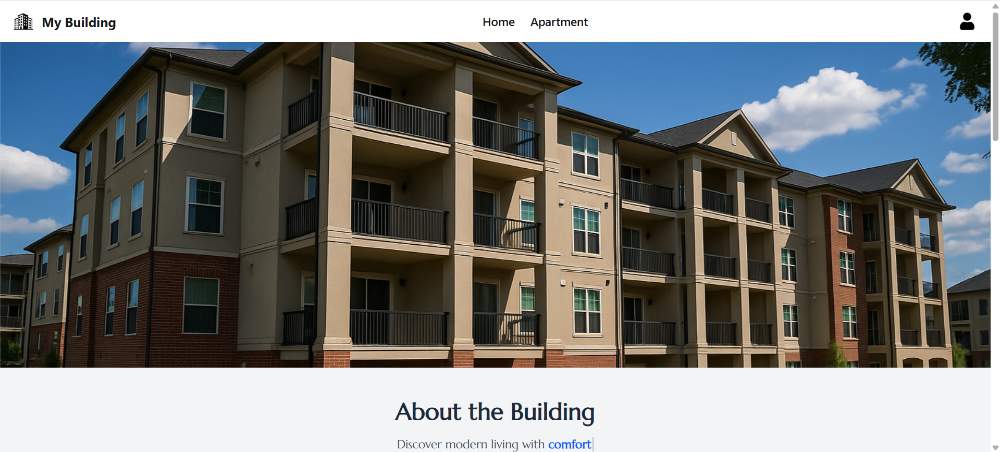
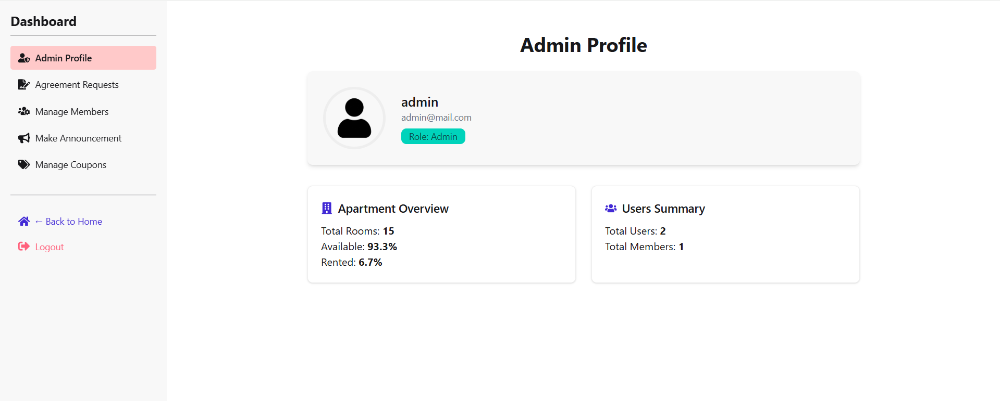

# Building Management — Client Side

## Overview

This is the frontend of the Building Management System built using React and Vite. It allows tenants to browse and apply for apartments, pay rent, use discount coupons, and access personalized dashboards. Admins can manage announcements, users, agreements, payments, and coupons.

---

## Live Site

[https://my-building.netlify.app](https://my-building.netlify.app)

---

## Purpose

To provide an organized and secure system for managing residential buildings — from rent payments and agreements to admin announcements and discounts — all in one place.

---

## Admin Credentials

- Email: **admin@mail.com**
- Password: **AdminAdmin**

---

## Key Features

### Users

- Firebase login (Email/Password)
- View available apartments with pagination and rent filters
- Apply for apartment agreement (only one allowed per user)
- Make secure rent payments with Stripe
- Use coupon codes for discounts
- View payment history
- Access a personalized dashboard

### Admin

- Manage announcements, coupons, and apartment agreements
- Approve/reject agreement requests
- View all users and their roles
- Add and manage active discount coupons

---

## Tech Stack

- React
- Vite
- Tailwind CSS
- DaisyUI
- React Router
- Firebase Authentication
- JWT Authentication
- Stripe Integration
- React Query
- React Icons

---

## Screenshots

### Home



### Dashboard



## Environment Variables

Create a `.env` file in the root of your client project:

```
VITE_API_BASE_URL=https://building-management-server-side-woad.vercel.app/
VITE_FIREBASE_API_KEY=your_firebase_api_key
VITE_FIREBASE_AUTH_DOMAIN=your_auth_domain
VITE_FIREBASE_PROJECT_ID=your_project_id
VITE_FIREBASE_STORAGE_BUCKET=your_storage_bucket
VITE_FIREBASE_MESSAGING_SENDER_ID=your_messaging_sender_id
VITE_FIREBASE_APP_ID=your_app_id
```

---

## Installation

1. Clone the repository:

```bash
git clone https://github.com/Programming-Hero-Web-Course4/b11a12-client-side-tsgm1257
```

2. Install dependencies:

```bash
npm install
```

3. Add the `.env` file as shown above.

4. Run the app locally:

```bash
npm run dev
```

---

## Available Scripts

- `npm run dev` — Start the development server
- `npm run build` — Build the project for production
- `npm run preview` — Preview the production build

## Author

Developed by Tanzeem Siddique
